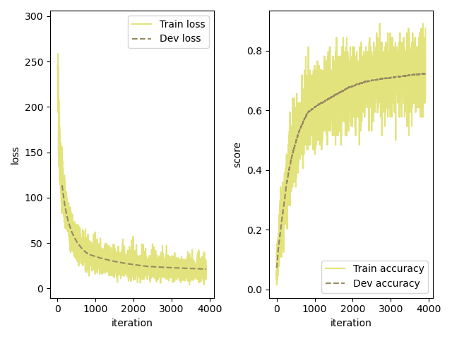
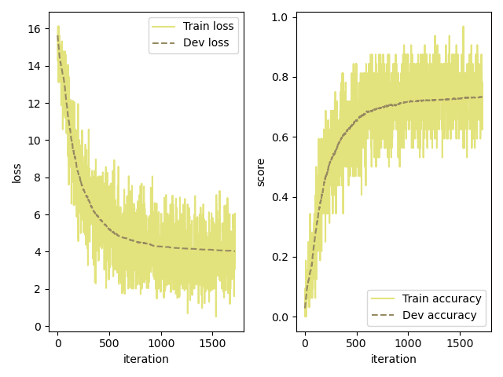
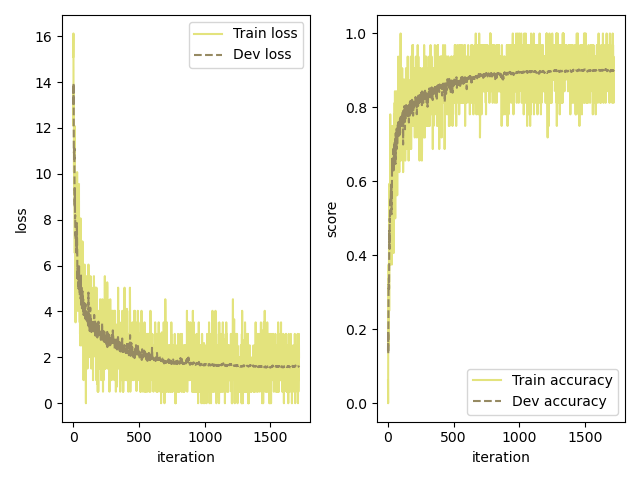
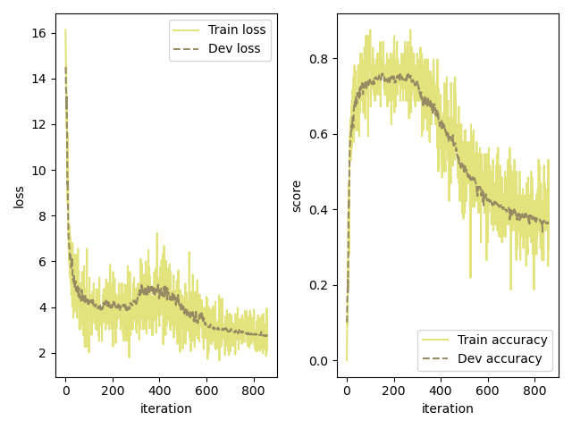
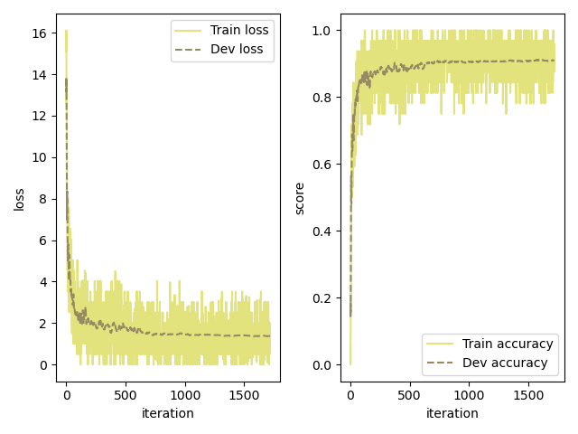
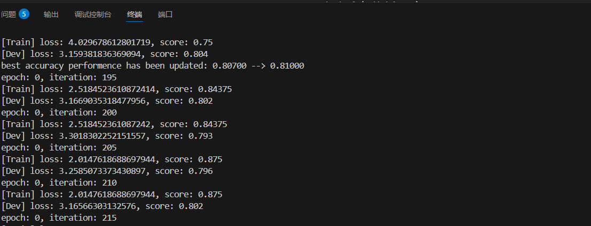
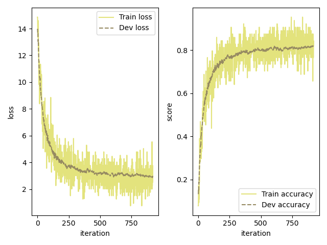
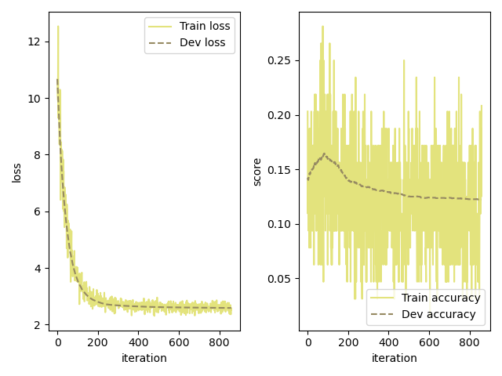
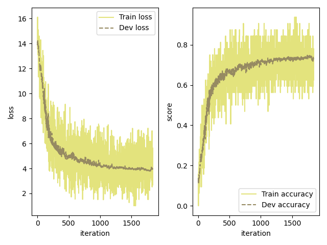

# 神经网络与深度学习Project-1 {#identifier .heading}

### 唐闻起&emsp;23307130310 {#identifier .heading}

## 1 前馈神经网络的实现

### 1.1 网络原理与结构

&emsp;&emsp;该部分实现代码主要在op.py的class Linear中。

- **网络结构**：基础网络由一个28×28个神经元的输入层、600个神经元的隐藏层和10个神经元的输出层组成。可训练参数共(28×28+1)×600 + (600+1)×10 = 477010个。
- **激活函数和损失函数**：输入层和隐藏层后添加了ReLU激活层；输出层后面接softmax激活函数，配合交叉熵损失函数计算损失。
- 优化算法采用SGD和BGD的平衡版本Mini-batch GD，batch_size为32（可调）。
- **学习率调整器**：多步分段衰减MultiStepLR。
- **正则化**： 采取“早停策略”，即一边在训练集上训练一边在验证集上检验，仅当验证集准确率上升时才保存模型权重。

&emsp;&emsp;对前向传播部分，有$$\left\{\begin{matrix}\pmb{z}^{(l)}=\pmb{W}^{(l)}\pmb{a}^{(l-1)}+\pmb{b}^{(l)}\\\pmb{a}^{(l)}=f_l(\pmb{z}^{(l)})\end{matrix}\right.$$&emsp;&emsp;对反向传播部分，设损失函数为$L(\pmb{y},\widehat{\pmb{y}})$,第L层神经元误差项为$\delta^{(l)}=\frac{\partial L}{\partial \pmb{z}^{(l)}}$，l层神经元的输入为$\pmb{a^{(l)}}$激活函数为$f_l$,则有$$\delta^l=f_l'(\pmb{z}^{(l)})*((\pmb{W}^{(l+1)})^T\delta^{(l+1)})$$ $$\frac{\partial L}{\partial \pmb{W}^{(l)}}=\delta^{(l)}(\pmb{a}^{(l-1)})^T$$ $$\frac{\partial L}{\partial \pmb{b}^{(l)}}=\delta^{(l)}$$
&emsp;&emsp;根据以上式子编写前向传播和反向传播的代码。

### 1.2 训练结果

&emsp;&emsp;训练五轮，准确率变化情况如图：
&emsp;&emsp;测试集上准确率为0.7372。**(权重文件为\saved_models\MLP_raw.pickle)**

### 1.3 改进

#### 1.3.1 增加隐藏层神经元数目

&emsp;&emsp;隐藏层神经元由600增加至900，训练时准确率变化如图：
&emsp;&emsp;测试集准确率为0.7573，略有提高。**(权重文件为\saved_models\MLP_3layers.pickle)**
#### 1.3.2 增加隐藏层层数

&emsp;&emsp;增加一层有600个神经元的隐藏层，训练时准确率变化如图：
&emsp;&emsp;测试集准确率提高至0.9085，效果明显。
&emsp;&emsp;然而，若将隐藏层增加至3层（再加一层300个神经元的隐藏层），结果如图：
&emsp;&emsp;在约250个epoch后准确率迅速下降，且拟合准确率最高仅为0.75左右。这表明，一定程度下，增加神经网络深度比增加每层网络神经元数更有用；但深度过大会导致过拟合，训练效果反而变差。

#### 1.3.3 使用动量法代替SGD

&emsp;&emsp;使用动量法代替SGD训练后（其余同1.3.2中两层隐藏层的情况，动量法代码见optimizer.py中的MomentGD），效果如图：
&emsp;&emsp;与1.3.2第一幅图对比可知，动量法准确率上升明显快于SGD，且震荡更小。在测试集上准确率为0.918，略高于SGD法。**(权重文件为\saved_models\MLP_MomentGD.pickle)**

## 2 卷积神经网络的实现

### 2.1 网络原理与结构

&emsp;&emsp;该部分实现代码主要在op.py的class Conv2D中。

- **网络结构**：基础网络由一层卷积层、一层全连接层和输出层组成。卷积层使用三个5×5的卷积核（输入一通道，输出三通道），全连接层有600个神经元，输出层10个神经元。可训练参数共3×(25+1)+(3×24×24+1)×600+601×10 = 1043488个。
- **激活函数和损失函数**：卷积层后不加激活层（原因见后），全连接层后加ReLU激活层，输出层后接softmax激活层配合交叉熵函数计算损失。
- **优化算法、学习率调整器和正则化**和1.1节所述相同。

&emsp;&emsp;对于前向传播，有$$\pmb{Z}^{(l,p)}=\sum_{d=1}^D\pmb{W}^{(l,p,d)}\otimes \pmb{X}^{(l-1,p)}+b^{(l,p)}$$&emsp;&emsp;对于反向传播，有$$\frac{\partial L}{\partial \pmb{W}^{(l,p,d)}}=\delta^{(l,p)}\otimes \pmb{X}^{(l-1,p)}$$ $$\frac{\partial L}{\partial b^{(l,p)}}=\sum_{i,j}[\delta^{(l,p)}]_{i,j}$$&emsp;&emsp;其中，若l+1层为汇聚层，有（up为上采样函数）$$\delta^{(l,p)}=f_l'(\pmb{Z}^{(l,p)})*up(\delta^{(l+1,p)})$$&emsp;&emsp;若l+1层为卷积层，则有$$\delta^{(l,d)}=f_l'(\pmb{Z}^{(l,d)})*\sum_{p=1}^P(rot180(\pmb{W}^{(l+1,p,d)})\widetilde{\otimes}\delta^{(l+1,p)})$$&emsp;&emsp;根据以上式子编写前向传播和反向传播代码。

### 2.2 训练结果

&emsp;&emsp;训练准确率变化情况如图：
&emsp;&emsp;约200个batch后准确率稳定在0.80左右，后续几乎没有上升（由于CNN训练速度远远慢于MLP，这里未等到5个epoch跑完提前终止了训练）。测试集上准确率为0.7978。鉴于我的CNN模型较为简单（仅有一层卷积层、三个卷积核，未加池化层，若设计太复杂在cpu上训练相当慢、难以调试），拟合能力有限，这样的准确率达到预期。
&emsp;&emsp;对比1.2中MLP和CNN训练结果，可知CNN在图像问题上有较好的训练效果。加深神经网络深度时，CNN更不易过拟合，进而可以达到比MLP更高的准确率。**(权重文件为\saved_models\CNN_raw.pickle)**

### 2.3 改进

#### 2.3.1 改变卷积核大小

&emsp;&emsp;将卷积核大小从5改为20，训练结果如图：
&emsp;&emsp;在测试集上准确率达到0.8396,略有提高。但卷积核过大弱化了卷积核提取局部特征的功能，导致卷积神经网络向前馈神经网络靠近；训练速度加快。可以预见，当卷积神经网络深度加大后，大卷积核训练效果将不如小卷积核。**(权重文件为\saved_models\CNN_big_kernel.pickle)**

### 2.4 卷积层后不加激活层的说明

&emsp;&emsp;最初构建CNN时在卷积层和全连接层后都添加了ReLU激活层，但训练结果如图：
&emsp;&emsp;准确率几乎没有上升，反而从0.15下降至0.1左右（图不完整）。考虑到随机猜测数字的准确率也为10%，该模型没有拟合效果。之后尝试修改前向传播和反向传播函数、添加全连接层层数均无好转，耽搁了较长时间。最后偶然发现去除卷积层后的ReLU后准确率升至80%左右，意识到训练效果差的原因可能为死亡ReLU问题！为验证此猜想，将卷积层后激活函数改为Leaky ReLU，当x<0的斜率γ设为常用的0.01时，准确率仍停留于0.1。尝试将γ提高为0.1，准确率能达到0.73，如图所示：
&emsp;&emsp;遂证明了死亡ReLU问题。